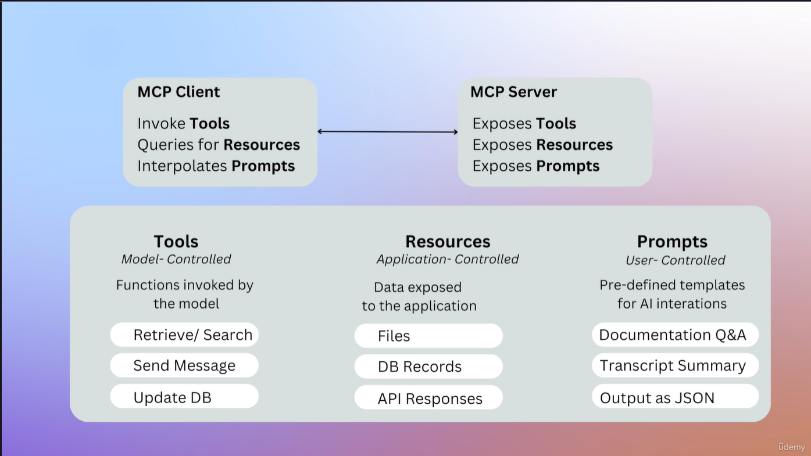
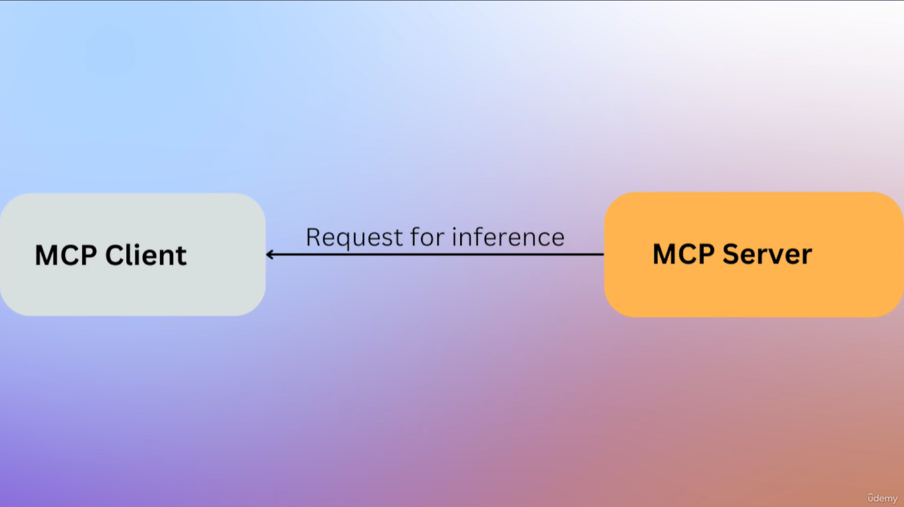

# Architettura e Funzionalità dei Server MCP 🖥️

## Introduzione all'MCP 🌐

I **server MCP** sono semplicemente interfacce o wrapper che **federano l'accesso a vari sistemi e strumenti**, rendendoli accessibili alle applicazioni AI in modo **standardizzato**. L'obiettivo è semplificare e standardizzare come le applicazioni AI interagiscono con strumenti e dati esterni.

I server MCP espongono funzionalità tramite tre interfacce principali:

1. **Strumenti (Tools)**: Funzioni controllate dal modello che l'AI può invocare quando necessario.
2. **Risorse (Resources)**: Dati controllati dall'applicazione che sono esposti al sistema AI.
3. **Prompt (Prompts)**: Template controllati dall'utente per interazioni comuni.

---

## Tipi di Funzionalità Esposte dai Server MCP 🛠️

### 1. **Strumenti (Tools)** 🔧

Gli **strumenti** sono funzioni controllate dall'AI che possono essere invocate quando necessario. Ad esempio, un'API meteo per ottenere previsioni o allarmi.

* **Esempio**: "Get Weather", "Get Forecast", "Get Alerts".
* **Libertà Totale**: I server MCP permettono di implementare qualsiasi tipo di funzionalità, come la lettura o scrittura di dati da e verso altri sistemi.
* **Controllo AI**: L'applicazione AI decide quando utilizzare questi strumenti, basandosi sul **contesto**.

### 2. **Risorse (Resources)** 📦

Le **risorse** sono dati esposti dal server MCP all'AI, che possono essere statici o dinamici:

* **Dati statici**: Come documenti PDF, immagini, file di testo, JSON.
* **Dati dinamici**: Come l'accesso a database o l'uso di **API esterne** per ottenere dati in tempo reale.

**Esempio**:

* Un file PDF con informazioni meteo.
* Dati provenienti da una ricerca in tempo reale tramite API.

### 3. **Prompt (Prompts)** 📝

I **prompt** sono modelli di interazione predefiniti, creati dall'utente, che vengono utilizzati per standardizzare le interazioni comuni con l'AI.

* **Funzionalità**: Consentono di **standardizzare** interazioni complesse.
* **Template**: I prompt sono template riutilizzabili che l'utente può invocare.

---

## Creazione di Server MCP 🏗️

### 1. **Creazione Manuale di un Server MCP** 💻

Si può scrivere un server MCP manualmente in **Python** o **Node.js**, ma richiede una certa quantità di codice (es. centinaia di linee).

### 2. **Generazione Automatica tramite AI di Server MCP** 🤖

Strumenti come **Cursor** o **MCP Generator** possono essere utilizzati per **generare server MCP automaticamente**. Questo rende l'intero processo molto più veloce e accessibile.

### 3. **Server MCP Costruiti dalla Comunità** 🌍

Esistono migliaia di **server MCP open-source** creati dalla comunità, che possono essere clonati, modificati e utilizzati. **Esempio**: Il server MCP per il meteo che abbiamo visto.

### 4. **Integrazioni Ufficiali** 🏢

Aziende come **Cloudflare** e **Stripe** mantengono i loro propri **server MCP ufficiali** per esporre le loro funzionalità, come API o strumenti, ai client MCP.

* Questi server sono **open-source** e disponibili per l'uso da parte della comunità.

---

## Non Reinventare la Ruota 🔄

Quando dobbiamo implementare un server MCP per una funzionalità di un servizio di terze parti (ad esempio, Stripe), **non reinventiamo la ruota**:

* La maggior parte dei fornitori, come **Stripe**, ha già implementato il proprio server MCP.
* Se c'è una funzionalità mancante, è meglio **contattare il fornitore** per scoprire se è già in programma o se possono implementarla per te.

---

## Come Eseguire un Server MCP 🚀

### 1. **Esecuzione Locale** 🖥️

Un server MCP può essere eseguito localmente utilizzando un **trasporto input/output standard (stdio)**:

* **Comando di esecuzione**: Invia e ricevi messaggi tramite la console.

### 2. **Esecuzione Remota** 🌐

Un server MCP può essere eseguito in modalità remota tramite **server sent events** o **SSH**.

### 3. **Esecuzione come Container Docker** 🐳

In alternativa, i server MCP possono essere eseguiti come **contenitori Docker**, facilitando la gestione e l'isolamento dell'ambiente di esecuzione.

---

## Funzionalità Avanzate di MCP: Sampling 🧠

La funzionalità di **sampling** consente al server MCP di richiedere al sistema AI (ad es Claude Desktop o Cursor) di generare una **completamento (completion)** dato un determinato prompt. Questa funzionalità apre la porta a molte possibilità, ma solleva anche **problemi di privacy e sicurezza** che verranno trattati in seguito nel corso.

---

## Composabilità e Agenti Multipli 🔄

Un aspetto interessante di MCP è che **qualsiasi applicazione o agente** può essere sia un **client MCP** che un **server MCP**. Questo permette di creare **applicazioni agentiche multi-layer** che consentono di avere **agenti specializzati** che si concentrano su compiti specifici.

---

## Prospettive Future di MCP 🔮

### 1. **Registrazione e Scoperta dei Server MCP** 📜

Prevediamo l'introduzione di un **registro centrale** per scoprire i server MCP. Questo renderà più facile **trovare e utilizzare** server MCP creati da altre persone.

### 2. **Verifica dei Server MCP Ufficiali** ✅

La verifica dei **server MCP ufficiali** aiuterà a prevenire **attacchi alla supply chain**, in cui server MCP dannosi potrebbero essere distribuiti con codice dannoso.

### 3. **Supporto per l'Autenticazione** 🔐

In futuro, MCP supporterà protocolli di autenticazione sicuri come **OAuth 2.0** per garantire l'accesso sicuro ai sistemi esterni.

### 4. **Sistemi Autonomi** 🤖

Prevediamo l'arrivo di **agenti auto-evolventi** che saranno in grado di **scoprire nuove capacità in tempo reale**. Questi agenti si adatteranno e apprenderanno in base alle esigenze, migliorando l'interazione con l'ambiente circostante.

---

## Conclusione 🎯

MCP è un protocollo potente che **standardizza** l'interazione tra applicazioni AI e **strumenti esterni**. Ci permette di:

* Integrare **facilmente** strumenti, risorse e prompt.
* Garantire **indipendenza dal fornitore** di LLM o applicazioni AI.
* Creare **applicazioni agentiche** più complesse e specializzate.

Il futuro di MCP sembra molto promettente, con la possibilità di **connessioni plug-and-play**, maggiore **sicurezza** e **agenti autonomi** che miglioreranno continuamente. 🚀

