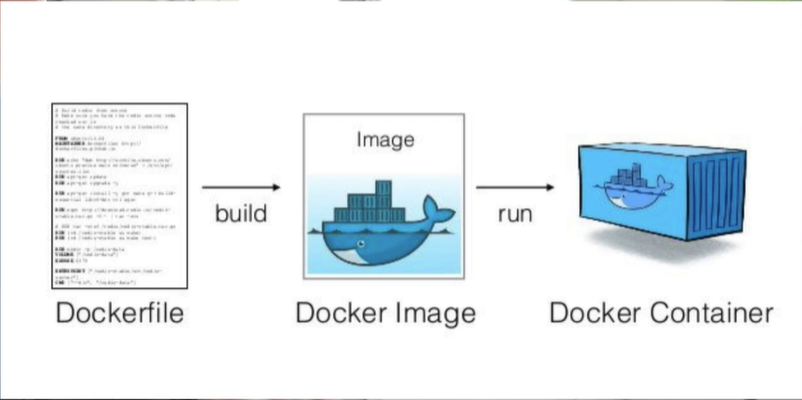

# 🐳 **Dockerizzazione del MCP Server**

## 🎯 Obiettivo del video

In questo episodio:

* 🧱 Scriviamo un **Dockerfile** per il server MCP
* 🔧 Compiliamo un’immagine Docker
* 🚀 Avviamo un container
* 🧩 Spieghiamo passo per passo cosa fa ogni sezione del Dockerfile
* ⚠️ Identifichiamo e correggiamo un errore comune

---

## 📂 1. Cos’è un Dockerfile?

Un `Dockerfile` è un file testuale che descrive:

* 🔹 L’immagine di base da usare (es. Python)
* 📦 Come installare le dipendenze
* 📁 Dove copiare il codice
* ▶️ Quale comando eseguire all’avvio del container



---

## ✍️ 2. Creazione del Dockerfile con Cursor

### Prompt usato:

> Write a Dockerfile to run this app in a container, I am using uv, checkout the docs: @https://docs.astral.sh/uv/guides/integration/docker/#installing-uv . The way I am running the command is inside the virtual environment: uv run server.py

📌 Cursor ha generato il contenuto (non il file direttamente), quindi Eden lo ha:

1. Copiato a mano
2. Creato come `Dockerfile` nella root del progetto

---

## 🔍 3. Spiegazione del Dockerfile

```dockerfile
# Immagine base ufficiale
FROM python:3.12-slim-bookworm
```

⚠️ *Verifica sempre l’affidabilità dell’immagine di base!*

```dockerfile
# Installa UV
RUN curl -Ls https://astral.sh/uv/install.sh | sh
ENV PATH="/root/.cargo/bin:${PATH}"
```

```dockerfile
# Imposta directory di lavoro
WORKDIR /app
```

```dockerfile
# Copia dei file per la gestione delle dipendenze
COPY pyproject.toml ./
COPY uv.lock ./
```

```dockerfile
# Installa solo le dipendenze (non ancora il codice)
RUN uv sync --frozen --no-install-project
```

🧠 Questo passaggio permette caching ottimizzato: le **dipendenze cambiano raramente**, quindi non vengono reinstallate ogni volta.

```dockerfile
# Copia il codice dell’app
COPY server.py ./
```

```dockerfile
# Installa il progetto come package Python
RUN uv sync --frozen
```

```dockerfile
# Comando finale di avvio
CMD ["uv", "run", "server.py"]
```

---

## 🐞 4. Bug comune: `uv.lock` mancante

* ❌ All’inizio mancava la copia di `uv.lock`
* 🛠️ Eden lo ha **decommentato** e risolto l’errore:

```dockerfile
# Fix
COPY uv.lock ./
```

---

## 🛠️ 5. Costruzione dell’immagine Docker

### Comando:

```bash
docker build -t shellserver-app .
```

* `-t`: assegna un nome e tag
* `.`: indica di usare il `Dockerfile` nella directory corrente

📦 Risultato:

* Immagine creata correttamente ✅
* Tag: `latest`
* Dimensione: \~200MB

---

## ▶️ 6. Esecuzione del container

### Comando:

```bash
docker run -it --rm shellserver-app
```

* `-it`: esecuzione interattiva
* `--rm`: rimuove il container dopo la chiusura
* `shellserver-app`: nome dell’immagine Docker

### Verifica con:

```bash
docker ps
```

✅ Container in esecuzione

📭 Nessun log? Normale! Il server non ha ancora ricevuto richieste.

---

## 📌 7. Perché dividere i due `uv sync`?

| Comando                              | Scopo                               | Caching                   |
| ------------------------------------ | ----------------------------------- | ------------------------- |
| `uv sync --no-install-project`       | Installa **solo le dipendenze**     | ✅                         |
| `uv sync` (dopo il `COPY server.py`) | Installa **il codice del progetto** | 🚫 (codice cambia spesso) |

📦 Questo approccio ottimizza la **ricostruzione dell'immagine**, evitando tempi lunghi ogni volta che si modifica il codice.

---

## 🧠 Conclusione

| Aspetto                 | Vantaggio                                   |
| ----------------------- | ------------------------------------------- |
| 📦 Docker               | Incapsula tutto: codice + dipendenze        |
| 🧼 UV                   | Package manager veloce e moderno            |
| ⚡ Build ottimizzato     | Caching tra layers                          |
| 📤 Pronto per il deploy | Su Kubernetes, serverless (EKS, GKE…), ecc. |

---

## ✅ Prossimi step

🔄 Integrare il **container MCP** con **Claude Desktop**, specificando come eseguire l’immagine dal client MCP.

---

