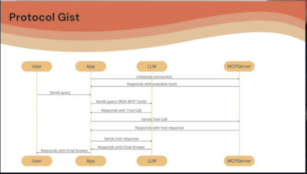

# 🧠 MCP Protocol – Architettura, Flusso e Confronto con LangChain

## 🎯 Obiettivo del video

> Capire **come funziona il protocollo MCP** a livello architetturale e **perché è una soluzione moderna** e scalabile per gestire tool calling in app AI-based

---

## 🗂️ Componenti principali

| Ruolo              | Descrizione                                                                      |
| ------------------ | -------------------------------------------------------------------------------- |
| 👤 **User**        | Invia query tramite un'app (Cursor, Windsurf, Claude ecc.)                              |
| 🖥️ **App/Host**   | L'interfaccia in cui vive il client MCP (es. Cursor, Graph agent, Claude Desktop) |
| 🤖 **LLM**         | Il modello che genera risposte e tool call                                       |
| 🔌 **MCP Client**  | Vive dentro l’app; comunica con MCP Server                                       |
| 🖥️ **MCP Server** | Espone tools, risorse e prompts via protocollo MCP                               |

---

## 🔁 Fasi del flusso MCP

### 1️⃣ **App boot**

🔸 Quando l'app viene lanciata (es. Cursor, Claude Desktop)
🔸 Il **MCP Client** inizia connessioni verso uno o più MCP Server
🔸 I Server rispondono con:

* 🧰 Lista dei tools
* 📄 Risorse disponibili (PDF, API, immagini, prompts, ecc.)

---

### 2️⃣ **Query dell’utente**

👤 L’utente invia una richiesta (prompt)

🔀 L’app invia al LLM:

* 🗣️ La query dell’utente
* 🔧 I tools disponibili (forniti dai server via MCP client)

📌 Tutto questo è costruito in un **prompt aumentato**
(*es. con schema ReAct o Function Calling*)

---

### 3️⃣ **Risposta del LLM**

🧠 L’LLM può:

* ✅ Rispondere direttamente
* 📞 Inviare un **tool call** al MCP server con:

  * Nome del tool
  * Argomenti richiesti

---

### 4️⃣ **Esecuzione del Tool**

🚨 **Differenza fondamentale con LangChain!**

| LangChain                    | MCP                              |
| ---------------------------- | -------------------------------- |
| Tool eseguito nell'app/agent | Tool eseguito nel **MCP server** |

📤 Il client invia al server:

* Nome del tool
* Argomenti

⚙️ Il **MCP server esegue** la funzione e restituisce l’output al client.

---

### 5️⃣ **Seconda invocazione LLM**

↩️ L'app invia:

* ❓ Query originale
* 🧾 Risultato tool

📬 L’LLM decide se:

* Restituire una risposta finale
* Fare un'altra tool call
* Porre una domanda all’utente

---

### 6️⃣ **Risposta finale all’utente**

📬 L’LLM invia la risposta definitiva
📤 L’app la presenta all’utente

---

---

## ⚙️ Confronto architetturale: LangChain vs MCP

| Caratteristica   | LangChain                           | MCP                                      |
| ---------------- | ----------------------------------- | ---------------------------------------- |
| Esecuzione tools | Interna all’app                     | Delegata al server                       |
| Modularità       | ❌ meno modulare                     | ✅ più modulare                           |
| Debug, logging   | Mescolato con la logica agent       | Isolato nel server                       |
| Scalabilità      | Limitata all'app                    | ✅ Scalabile via Docker, Kubernetes, ecc. |
| Orchestrazione   | Orchestration + execution mescolati | ✅ Orchestrazione (fatta dall'app) separata da execution (fatta sul MCP Server)   |

---

## 🌍 Vantaggi dell’approccio MCP

✅ **Decoupling** tra:

* 🤖 Logica agent
* 🧰 Tool execution

✅ **Dinamismo**:

* Il client può aggiornare periodicamente i tools disponibili
* ➕ Supporta tools dinamici senza **redeploy**

✅ **Scalabilità**:

* Ogni tool può vivere nel suo container
* Supporta orchestratori esterni (es. Kubernetes)

✅ **Standardizzazione**:

* MCP è un protocollo **standard** per tool/resource exposition

---

## 💡 Esempio concreto

> Se oggi aggiornassimo un MCP server con un nuovo tool,
> non dovremmo **toccare né redeployare** l’agente o l’app!

🚀 L’agente MCP-aware riceverà il nuovo tool al prossimo ciclo di inizializzazione!

---

## 🔜 Prossimo step

Nel prossimo video vedremo **come integrare un MCP Client all’interno di un LangGraph Agent**, così da vedere **questo flusso in azione**.

---
