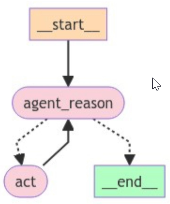

# 🚀 Implementazione del Client MCP e ReAct Agent (LangGraph)

## 📌 Obiettivo

Costruire un client MCP che:

* avvia un server MCP (math),
* riceve e carica i tools esposti,
* li converte in LangChain tools,
* li integra in un **LangGraph ReAct Agent** capace di eseguire richieste utente.

---

## 🔧 1. Creazione del Client MCP via `StdioClient`

### 📌 Obiettivo

Creare un client MCP che agisce come **proxy** tra l'MCP server e l'agente LangGraph che in questo caso è l'MCP Host.
Un proxy è come un intermediario tra te e internet.
Il Client ha bisogno di sapere due cose:
1. Deve sapere come runnare il server MCP, ovvero quali comandi eseguire per avviare il server.
2. Deve sapere come comunicare con il server MCP, ovvero come inviare e ricevere messaggi.

Questi due parametri gli diamo al stdio_client con StdioServerParameters.
Dunque, quando inizializziamo le due variabili "command" e "args" con `StdioServerParameters`, stiamo dicendo al client come avviare il server MCP. E l'oggetto stesso `StdioServerParameters` ha le informazioni necessarie per stabilire la comunicazione tra il client e il server via Stdio.

Ora definiamo e usiamo il Stdio client context manager al quale passiamo i StdioServerParameters. 


### ✨ Struttura

```python
async with stdio_client(stdio_server_params) as (read, write):
```

* `stdio_client`: client MCP che comunica via `stdin`/`stdout`.
* `stdio_server_params`: oggetto con:

  * `command`: es. `"python"`,
  * `args`: path assoluto del file server MCP da eseguire.

> ✅ MCP SDK gestisce internamente i dettagli di avvio e comunicazione del server.

---

## 🔁 2. Creazione della `ClientSession`

Ora dobbiamo creare la `ClientSession` perchè ogni client si collega ad un server MCP tramite una sessione.
E alimentiamo la sessione con i canali di comunicazione `read` e `write` ottenuti dal client.
Ora il Client sa come runnare e comunicare con il server MCP.

```python
async with ClientSession(read_stream=read, write_stream=write) as session:
```

* La `ClientSession` stabilisce la **connessione 1:1** tra client e server.
* Responsabile della comunicazione (invio/ricezione messaggi, notifiche).
* Espone il metodo `initialize()` per avviare la connessione secondo protocollo MCP.

> 🧠 **Nota**: come sviluppatori, trattiamo `ClientSession` come una black box — non serve conoscerne i dettagli interni, è stata gestita nell'SDK.

---
## Diamo un'occhiata al MCP Flow


Per prima cosa vogliamo inizializzare la connessione (initialize connection) e ora abbiamo tutti i dettagli per farlo.

---

## ⚙️ 3. Inizializzazione della Sessione

```python
await session.initialize()
print("Session initialized")
```

Dopo l'inizializzazione:

* Il client riceve dal server le **entità esposte**:

  * 🛠️ `tools`
  * 📄 `resources`
  * 🧠 `prompts`

---

## 📚 4. Recupero dei Tool

* Chiediamo al client quali sono i tools che il server MCP ha esposto.

```python
tools = await session.list_tools()
print(tools)
```

Output (semplificato):

```json
[
  {
    "name": "add",
    "description": "Add two numbers",
    "parameters": {...},
    "returns": {...}
  },
  {
    "name": "multiply",
    "description": "Multiply two numbers",
    ...
  }
]
```

* Strttura dei MCP tools:

```python
tools=[Tool(name='add', description='Add two numbers', inputSchema={'properties': {'a': {'title': 'A', 'type': 'integer'}, 'b': {'title': 'B', 'type': 'integer'}}, 'required': ['a', 'b'], 'title': 'addArguments', 'type': 'object'}, annotations=None), Tool(name='multiply', description='Multiply two numbers', inputSchema={'properties': {'a': {'title': 'A', 'type': 'integer'}, 'b': {'title': 'B', 'type': 'integer'}}, 'required': ['a', 'b'], 'title': 'multiplyArguments', 'type': 'object'}, annotations=None)]
```

Questi sono i tool MCP nativi del `math_server`. Come vedi hanno una struttura diversa rispetto ai tool LangChain.

---

## 🧠 5. Creazione del ReAct Agent (LangGraph)

* Ora vogliamo creare la Host application che contiene l'MCP Client (che comunica con il server MCP) e comunica con esso in modo da poter usare i tool MCP esposti.

* Nel nostro caso la Host application è un agente LangGraph. Poi l'utente comunicherà con esso.



```python
from langgraph.prebuilt import create_react_agent

agent = create_react_agent(llm=llm, tools=tools)
```

🔴 **Errore atteso**:

> `TypeError: First argument must be a string or a callable...`

📌 **Motivo**:
`tools` è una lista di oggetti **MCP Tool**, non di oggetti **LangChain Tool**.

---

## 🔁 6. Conversione Tool MCP → Tool LangChain

* Dato che usiamo LangGraph react agent, dobbiamo convertire i tool MCP in un formato accettato da LangChain.
* Per farlo, usiamo la funzione `load_mcp_tools` che converte i tool MCP in LangChain tools.

```python
from langchain_mcp_adapters.tools import load_mcp_tools

tools = await load_mcp_tools(session)
```

* Struttura dei tools LangChain:

```python
[StructuredTool(name='add', description='Add two numbers', args_schema={'properties': {'a': {'title': 'A', 'type': 'integer'}, 'b': {'title': 'B', 'type': 'integer'}}, 'required': ['a', 'b'], 'title': 'addArguments', 'type': 'object'}, response_format='content_and_artifact', coroutine=<function convert_mcp_tool_to_langchain_tool.<locals>.call_tool at 0x000002480DCA0700>), StructuredTool(name='multiply', description='Multiply two numbers', args_schema={'properties': {'a': {'title': 'A', 'type': 'integer'}, 'b': {'title': 'B', 'type': 'integer'}}, 'required': ['a', 'b'], 'title': 'multiplyArguments', 'type': 'object'}, response_format='content_and_artifact', coroutine=<function convert_mcp_tool_to_langchain_tool.<locals>.call_tool at 0x000002480DCA0820>)]
```

* Converte tool MCP nel formato accettato da LangChain.
* Funziona passando solo la `session` che contiene i tool esposti.

✅ Ora l'agente può essere creato correttamente:

```python
agent = create_react_agent(model=llm, tools=tools)
```

---

## 🧪 7. Test dell’Agente

```python
from langchain_core.messages import HumanMessage

response = await agent.ainvoke({
    "messages": [HumanMessage(content="What is 2 + 2?")]
})
print(response['messages'][-1].content)
```

🔍 `HumanMessage` è parte del modulo `langchain_core.messages`.

> ✅ L'agente usa il tool `add` esposto dal math\_server MCP per rispondere.

---

## 📦 8. Workflow Completo Riepilogato

| Step | Azione                                                                |
| ---- | --------------------------------------------------------------------- |
| 1️⃣  | Il `StdioClient` avvia il server MCP (`math_server.py`)               |
| 2️⃣  | Viene stabilita una `ClientSession`                                   |
| 3️⃣  | Il client chiama `initialize()`                                       |
| 4️⃣  | I tool vengono recuperati via `list_tools()`                          |
| 5️⃣  | I tool MCP vengono convertiti in LangChain tools                      |
| 6️⃣  | Viene creato un `ReAct Agent` con `create_react_agent()`              |
| 7️⃣  | L'agente è in grado di rispondere a richieste utente invocando i tool |

---

## ✅ Conclusione

Abbiamo costruito l’intero flusso client–server MCP e integrato con successo:

* Un **server MCP** (math),
* Un **client MCP** (Stdio),
* Una **sessione** che stabilisce la comunicazione,
* Una **conversione tool** con `load_mcp_tools`,
* Un **agente LangGraph** completamente operativo.

---

