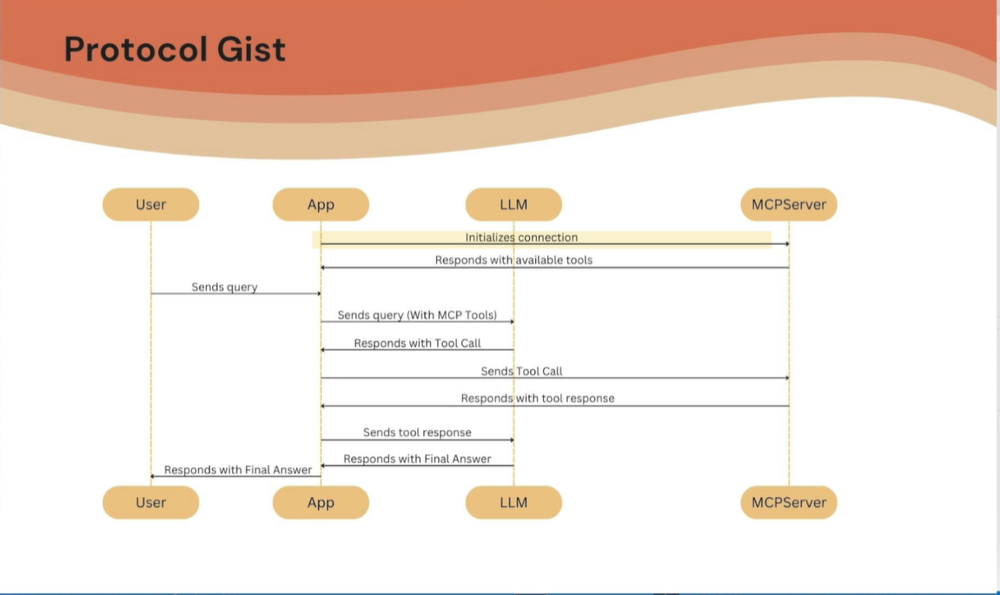

# 🧠 MCP + LangGraph: Esecuzione, Tool Calling e Tracciamento

## 🎯 Obiettivo

Mostrare come un agente ReAct di LangGraph utilizza un MCP client per invocare tool remoti (esposti da un MCP server), mantenendo un'architettura modulare e decoupled.

---

## 🔁 Flusso completo di esecuzione (2+2)

### ✅ 1. Esecuzione di `main.py`

* Sessione inizializzata ✅
* Richiesta `list_tools` gestita ✅
* Richiesta `call_tool` eseguita ✅

> L’agente ReAct di LangGraph agisce come **host MCP** che usa il **client MCP** per invocare strumenti remoti.

---

## 🔍 2. Come funziona il flusso MCP



### ✳️ Step-by-step:

1. **Utente invia una query** (es. `"What is 2 + 2?"`)
2. **LangGraph ReAct Agent** (MCP Host) riceve il prompt
3. L’agente invia al **LLM** (es. `ChatOpenAI`) il messaggio utente + lista degli MCP tool disponibili
4. Il **LLM risponde**: “Chiama `add` con argomenti `2` e `2`”
5. Il **client MCP** comunica con il **server MCP** (via `stdio` o `SSE`)
6. Il **server esegue** la funzione `add(2, 2)` e restituisce `4`
7. Il **client MCP** inoltra la risposta al **LangGraph Agent**
8. L’agente formatta la risposta finale e la invia al LLM per il completamento
9. Il **LLM** restituisce `"2 + 2 = 4"` come output finale
10. Il **LangGraph Agent** invia la risposta all'utente

✅ **Responsabilità separate**:

* **LangGraph** → orchestrazione, interfaccia utente
* **MCP Server** → esecuzione tool remota

---

## 🧪 3. Test più complesso: `54 + 2 * 3`

### 📥 Prompt:

```text
What is 54 + 2 * 3?
```

### 📤 Output:

```text
60
```

### 🔎 Struttura delle invocazioni rilevate:

LangGraph ha effettuato **3 chiamate a strumenti**:

1. `multiply(2, 3)` → `6`
2. `add(54, 0)` → `54` ← ❗ Tool call inaspettata
3. `add(54, 6)` → `60`

> 🧠 Questo comportamento mostra che LangGraph può effettuare **chiamate concorrenti** agli strumenti MCP.

---

## 📊 4. Analisi con LangSmith Trace

### 📌 Primo Esempio: `2 + 2`

* Tool chiamato: `add`
* Input: `2`, `2`
* Output: `4`
* Tool disponibili: `add`, `multiply`
* Prompt originale + tools inclusi nel payload del messaggio LLM

### 📌 Secondo Esempio: `54 + 2 * 3`

* Tool chiamati:

  1. `add(54, 0)` ❓
  2. `multiply(2, 3)` → `6`
  3. `add(54, 6)` → `60`

#### 🧩 Tool Call Misteriosa: `add(54, 0)`

* Origina da una prima interpretazione del modello LLM
* Eseguita in parallelo a `multiply(2, 3)` grazie al **supporto concorrente di LangGraph**
* Timestamp identici nel tracing confermano esecuzione simultanea

---

## 📁 5. Commit finale del codice

* Modifiche implementate in `main.py`
* Commit eseguito tramite **Cursor**
* Push su GitHub completato
* Artefatto accessibile nella branch corrente del repository

---

## ✅ Conclusione

| Componente          | Responsabilità                                                                |
| ------------------- | ----------------------------------------------------------------------------- |
| **MCP Client**      | Comunica con il server, esegue i tool remoti                                  |
| **MCP Server**      | Espone tool (`add`, `multiply`) via `stdio` o `sse`                           |
| **LangGraph Agent** | Orchestrazione: riceve query, invia tool calls al client, aggrega le risposte |
| **LangSmith**       | Tracciamento dettagliato delle esecuzioni agent-based                         |

---

## 🔮 Approfondimenti futuri suggeriti

* 📌 Come gestire tools con dipendenze sequenziali in LangGraph
* 🧵 Differenza tra `ReAct`, `Conversational`, e `Tool-Calling Agents`
* 🌐 Hosting MCP server via `SSE` su Docker o Kubernetes
* 🔐 Sicurezza nella comunicazione client-server MCP

---
