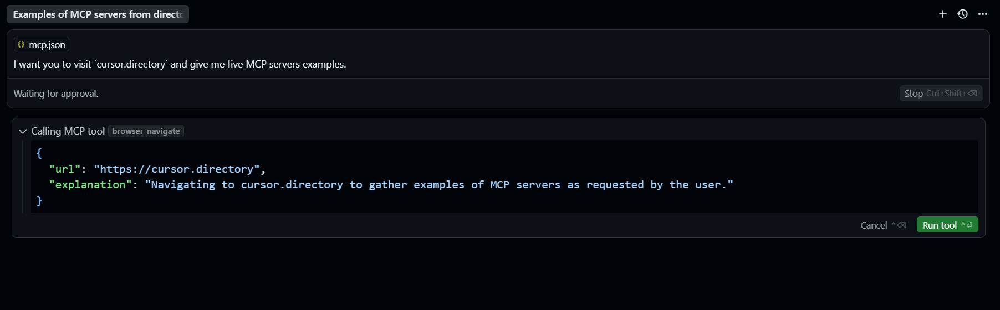
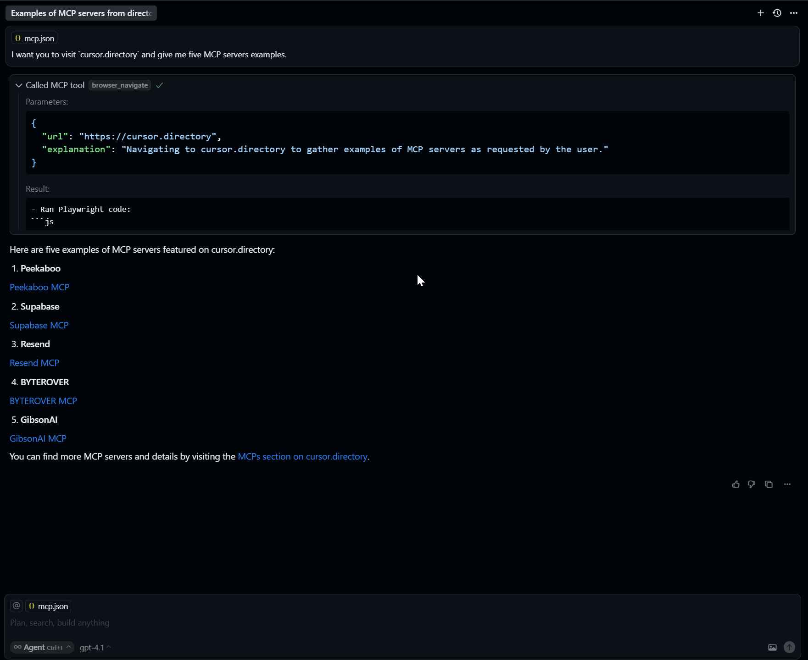

# 🌐 Appunti – Integrazione del Playwright MCP Server in Cursor

## 🎯 Obiettivo

Integrare un nuovo MCP server – nello specifico, **l’MCP server ufficiale di Microsoft basato su Playwright** – all’interno di **Cursor**, per permettere agli agenti AI di **navigare il web tramite browser**.

---

## 🧭 1. Cos'è il Playwright MCP Server?

📌 Il **Microsoft Playwright MCP Server** consente di:

* Aprire browser reali (es. Chrome)
* Navigare su siti web
* Recuperare contenuti in tempo reale
* Automatizzare interazioni nel browser

⚡ È estremamente utile per **potenziare agenti AI con funzionalità di web browsing dinamico**.

---

## 🧪 2. Setup del progetto: Clonazione del server

💡 Per integrare il server in Cursor:

1. 🔗 Copia l’URL del repository MCP server Playwright
2. 🖥️ Clona il repository nella tua directory locale:

```bash
git clone https://github.com/microsoft/playwright-mcp.git
```

---

## 💼 3. Integrazione con Cursor

🔧 All’interno del progetto Cursor:

1. Crea una cartella nascosta:

```bash
mkdir .cursor
```

2. All’interno di `.cursor`, crea un file `mcp.json` che conterrà la configurazione di tutti i servers MCP:

```bash
touch mcp.json
```

3. ✍️ Incolla al suo interno la configurazione MCP server dal `README.md` del repository Playwright:

```json
{
  "mcpServers": {
    "playwright": {
      "command": "npx",
      "args": [
        "@playwright/mcp@latest"
      ]
    }
  }
}
```

✅ Cursor rileva automaticamente il nuovo MCP server e mostra un prompt **"Enable"**.

4. 🔘 Clicca **Enable** → l’MCP server è pronto all’uso!

---

## 🤖 4. Test tramite Agent Mode

🧪 Testiamo subito il tool con una richiesta:

> “I want you to visit `cursor.directory` and give me five MCP servers examples.”



🎬 Cosa succede:

* Cursor invoca il tool `browser_navigate`
* Il parametro URL è `cursor.directory`
* 🧭 Si apre un’istanza di **Chrome**
* Viene visitato il sito
* ✅ Il contenuto viene letto e parsato

📥 Risultato: l’agente restituisce **un elenco di MCP server** trovati sulla pagina.



---

## 🔁 5. Esperienza e flusso di lavoro

💡 Questo flusso di lavoro dimostra quanto sia:

* 📦 **Semplice integrare nuovi MCP server**
* 🤖 **Potente l’approccio agent-based**
* 🔗 **Modulare** la connessione tra Cursor e strumenti remoti

📌 Una volta configurato `.cursor/mcp.json`, ogni progetto può disporre dei propri **tool agentici su misura**, con server MCP locali dedicati.

---

## ✅ Riepilogo Finale

| Step              | Azione                                        |
| ----------------- | --------------------------------------------- |
| 🌐 Server usato   | Microsoft Playwright MCP Server               |
| 🔧 Configurazione | Clonata e configurata in `.cursor/mcp.json`   |
| 🧠 Integrazione   | Rilevata automaticamente da Cursor            |
| 🧪 Test           | Navigazione web dinamica da parte dell’agente |
| 📈 Output         | Lista di MCP server da `cursor.directory`     |

---

## 🔚 Conclusione

Grazie al supporto MCP e all’integrazione nativa con Cursor:

* 💡 Gli agenti AI diventano **browser-based**
* 🧩 L’aggiunta di strumenti è **modulare e scalabile**
* 🔐 L’esecuzione rimane **locale**, aumentando privacy e sicurezza

---